# Exploring the BRFSS data

## Setup

### Load packages


```r
library(ggplot2)
library(dplyr)
```


```r
load("brfss2013.RData")
```

## Part 1: Data
- Causality cannot be imputed as random assignment did not take place. Only random selection was carried out.
- Findings on data can be somewhat generalised to US population as random selection was done.
- However, interview method might unfairly exclude members of the population who do not have    access to mobile phone or landline. Particularly, illegal immigrants might be excluded even   though they form part of the population of interest.

## Part 2: Research questions

**Research quesion 1:**
Is there a link between physical and mental health?
- It is interesting to consider whether is there a relationship between the numbers of days of poor mental and physical health. It may be possible that poor physical and mental health are closely related, thus meaning that increased days mentally unwell might be a predictor of more days physically unwell.

**Research quesion 2:**
Is there a relationship between mental health and alcohol comsumption?
- It may be suggested that poor mental health might lead to increased tendency to consume alcohol. This is due to the possibly poorer decision making ability during times of mental illness. There might be a positive relationship between these two variables.

**Research quesion 3:**
Is there a link between physical health and sleeping time?
- Researches have shown that low sleeping time might lead to poorer physical health as sleep is vital for the body's repair and rejuvenation. Thus, it is interesting to consider whether is there a positive relationship between sleeping time and physical health among US citizens.

## Part 3: Exploratory data analysis

**Research quesion 1:**


```r
#Is there a link between physical and mental health?

#Isolate data of interest
data.rq1 <- brfss2013 %>%
  select(physhlth, menthlth) %>%
  filter(!is.na(physhlth)) %>%
  filter(!is.na(menthlth))
require(reshape2)
```

```
## Loading required package: reshape2
```

```r
data.long.rq1 <- melt(data.rq1)
```

```
## No id variables; using all as measure variables
```

```r
data.long.rq1.men <- melt(data.rq1$menthlth)
data.long.rq1.phy <- melt(data.rq1$physhlth)

#summary of physhlth
data.rq1 %>%
  summarise(mean_phy = mean(physhlth), med_phy = median(physhlth), iqr_phy = IQR(physhlth), sd_phy = sd(physhlth), max_phy = max(physhlth), min_phy = min(physhlth), n = n())
```

```
##   mean_phy med_phy iqr_phy   sd_phy max_phy min_phy      n
## 1 4.297961       0       3 8.794679      60       0 474575
```

```r
#summary of menthlth
data.rq1 %>%
  summarise(mean_men = mean(menthlth), med_men = median(menthlth), iqr_men = IQR(menthlth), sd_phy = sd(menthlth),  max_men = max(menthlth), min_men = min(menthlth),  n = n())
```

```
##   mean_men med_men iqr_men   sd_phy max_men min_men      n
## 1 3.369501       0       2 10.56872    5000       0 474575
```

```r
#histogram of menthlth
ggplot(data = data.long.rq1.men, aes(x = value)) + geom_histogram(binwidth = 50)
```

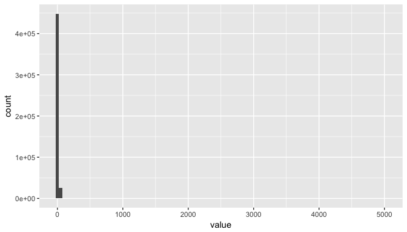<!-- -->

```r
#histogram of physhlth
ggplot(data = data.long.rq1.phy, aes(x = value)) + geom_histogram(binwidth = 5)
```

<!-- -->

The value of 5000 distorts the graphical analysis of this variable. A peek into the table shows that the values of this observation are (60, 5000). Although this observation might well be true, it is also highly plausible that this is a survey error. Thus, subsequent analyses will exclude it.

###Post data deletion


```r
new.data.rq1 <- data.rq1[-212181,]
new.data.long.rq1 <- melt(new.data.rq1)
```

```
## No id variables; using all as measure variables
```

```r
new.data.long.rq1.phy <- melt(new.data.rq1$physhlth)
new.data.long.rq1.men <- melt(new.data.rq1$menthlth)

#summary of physhlth
new.data.rq1 %>%
  summarise(mean_phy = mean(physhlth), med_phy = median(physhlth), iqr_phy = IQR(physhlth), sd_phy = sd(physhlth), max_phy = max(physhlth), min_phy = min(physhlth), n = n())
```

```
##   mean_phy med_phy iqr_phy   sd_phy max_phy min_phy      n
## 1 4.297844       0       3 8.794317      30       0 474574
```

```r
#histogram of physhlth
ggplot(data = new.data.long.rq1.phy, aes(x = value)) + geom_histogram(binwidth = 5)
```

<!-- -->

Physhlth appears to be both unimodal and right skewed. Although the mode is at zero days, 30 days seem to be a common observation. Based on the mean and standard deviation, such observation of 30 is unusual as it lies beyond 3 SD of the mean.


```r
#summary of menthlth
new.data.rq1 %>%
  summarise(mean_men = mean(menthlth), med_men = median(menthlth), iqr_men = IQR(menthlth), sd_phy = sd(menthlth),  max_men = max(menthlth), min_men = min(menthlth),  n = n())
```

```
##   mean_men med_men iqr_men   sd_phy max_men min_men      n
## 1 3.358972       0       2 7.687004     247       0 474574
```

```r
#histogram of menthlth
ggplot(data = new.data.long.rq1.men, aes(x = value)) + geom_histogram(binwidth = 5)
```

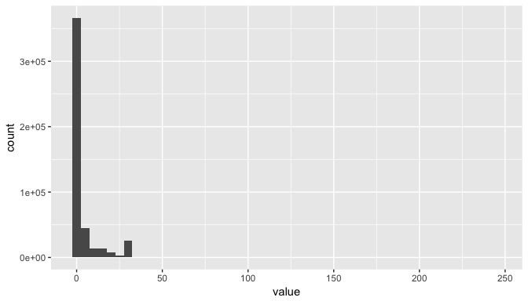<!-- -->

Again, Menthlth shows extreme outliers in 247, which lies far beyond three SD away from the mean. However, its distribution is rather similar to Physhlth.


```r
#boxplot
ggplot(data = new.data.long.rq1, aes(x = variable, y = value)) + geom_boxplot()
```

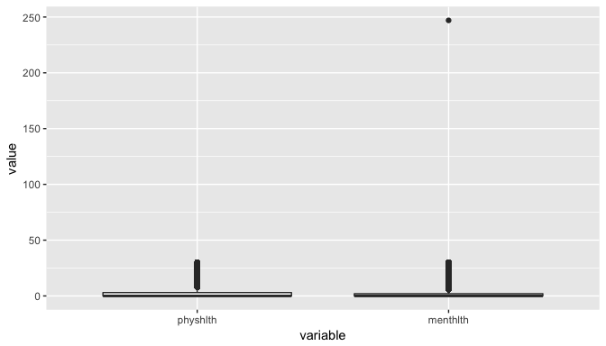<!-- -->

From a vantage point, these two variables seems to be rather similarly distributed, as suggested above, except for the value of 247 in menthlth.


```r
#Scatterplot
ggplot(data = new.data.rq1, aes(x = menthlth, y = physhlth)) + geom_point(shape = ".")
```

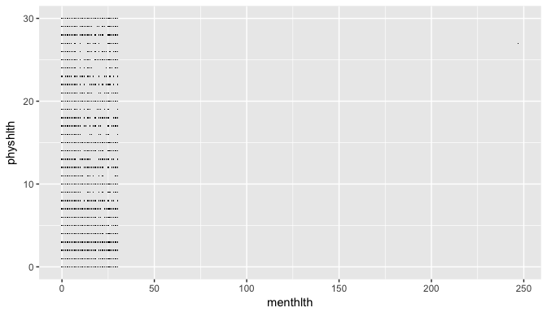<!-- -->

##Conclusion

From the scatterplot, there appears to be no relationship between the duration physically ill and the duration mentally ill among US citizens. This is because the scatterplot formed a chunk on the bottom left corner, suggesting that there is no correlation between the two variables. 

**Research quesion 2:**


```r
#Is there a relationship between mental health and alcohol comsumption?

#Isolate data of interest
data.rq2 <- brfss2013 %>%
  select(avedrnk2, menthlth) %>%
  filter(!is.na(avedrnk2)) %>%
  filter(!is.na(menthlth))

require(reshape2)
data.long.rq2 <- melt(data.rq2)
```

```
## No id variables; using all as measure variables
```

```r
data.long.rq2.men <- melt(data.rq2$menthlth)
data.long.rq2.ave <- melt(data.rq2$avedrnk2)

#summary of avedrnk2
data.rq2 %>%
  summarise(mean_ave = mean(avedrnk2), med_ave = median(avedrnk2), iqr_ave = IQR(avedrnk2), sd_ave = sd(avedrnk2), max_ave = max(avedrnk2), min_ave = min(avedrnk2), n = n())
```

```
##   mean_ave med_ave iqr_ave  sd_ave max_ave min_ave      n
## 1 2.208679       2       1 2.30247      76       1 228705
```

```r
#histogram of avedrnk2
ggplot(data = data.long.rq2.ave, aes(x = value)) + geom_histogram(binwidth = 5)
```

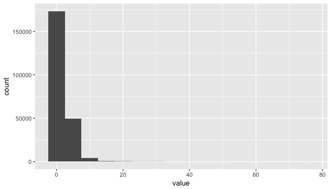<!-- -->

Avedrnk2 appears to be heavily right skewed with most of the observation to be zero. Summary statistics also shows that the maximum value of 76 is unusual as it is beyond 3 sd away from the mean.


```r
#summary of menthlth
data.rq2 %>%
  summarise(mean_men = mean(menthlth), med_men = median(menthlth), iqr_men = IQR(menthlth), sd_phy = sd(menthlth),  max_men = max(menthlth), min_men = min(menthlth),  n = n())
```

```
##   mean_men med_men iqr_men   sd_phy max_men min_men      n
## 1 2.963735       0       2 6.969874      30       0 228705
```

```r
#histogram of menthlth
ggplot(data = data.long.rq2.men, aes(x = value)) + geom_histogram(binwidth = 5)
```

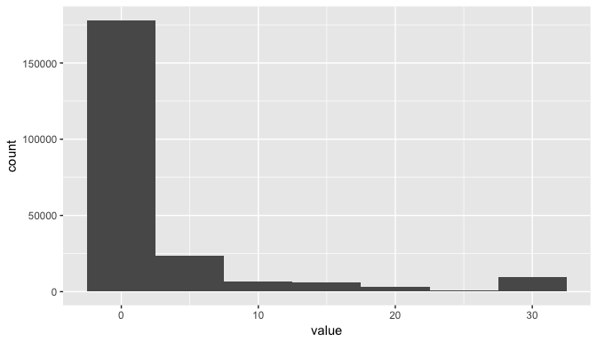<!-- -->

The information from menthlth here is the same as the information obtained in the previous section. A change worth noting is a reduction in the observation of 30, which is due to the NA filter done in the beginning.


```r
#boxplot of avedrnk2 and menthlth
ggplot(data = data.long.rq2, aes(x = variable, y = value)) + geom_boxplot()
```

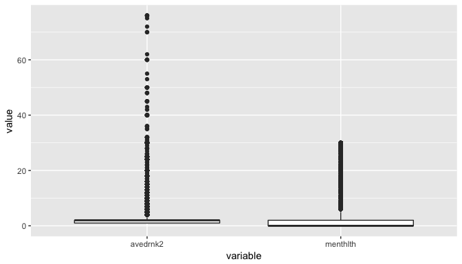<!-- -->

Based on the boxplot, avedrnk2 has a greater distribution of extreme values than menthlth. Moreover, menthlth has a more compact distribution than avedrnk2, which might suggest that US citizens are generally healthy mentally regardless of their drinking habits.


```r
#scatterplot of avedrnk2 and menthlth
ggplot(data = data.rq2, aes(menthlth, avedrnk2)) + 
  geom_point(alpha = 1/5) + geom_smooth()
```

```
## `geom_smooth()` using method = 'gam'
```

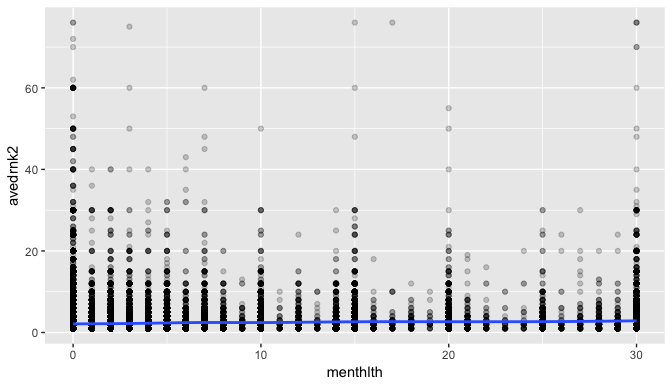<!-- -->

##Conclusion

From this diagram, there appears to be no positive and strong correlation between drinking habits and mental health among the US citizens. This is shown by the almost flat line drawn across the scatterpoints. Moreover, the scatterpoints also appear to be randomly plotted, furthering the notion that there is no relationship between avedrnk2 and menthlth among the US citizens.

**Research quesion 3:**


```r
#Is there a link between physical health and sleeping time?

#Isolate data of interest
data.rq3 <- brfss2013 %>%
  select(sleptim1, physhlth) %>%
  filter(!is.na(sleptim1)) %>%
  filter(!is.na(physhlth))

require(reshape2)
data.long.rq3 <- melt(data.rq3)
```

```
## No id variables; using all as measure variables
```

```r
data.long.rq3.sle <- melt(data.rq3$sleptim1)
data.long.rq3.phy <- melt(data.rq3$physhlth)

#summary of sleptim1
data.rq3 %>%
  summarise(mean_sle = mean(sleptim1), med_sle = median(sleptim1), iqr_sle = IQR(sleptim1), sd_sle = sd(sleptim1), max_sle = max(sleptim1), min_sle = min(sleptim1), n = n())
```

```
##   mean_sle med_sle iqr_sle   sd_sle max_sle min_sle      n
## 1 7.050634       7       2 1.593205     450       0 474462
```

```r
#histogram of sleptim1
ggplot(data = data.long.rq3.sle, aes(x = value)) + geom_histogram(binwidth = 5)
```

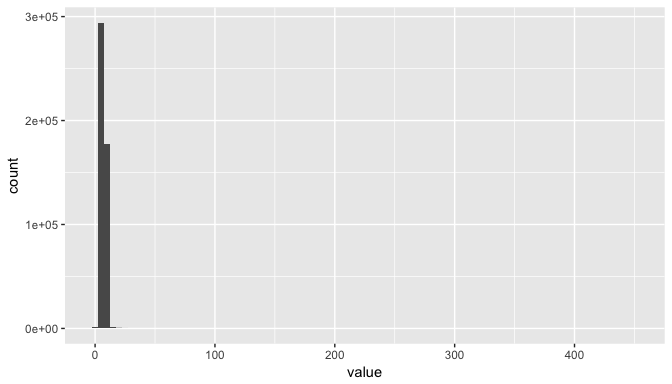<!-- -->

As expected the mean and median number of sleep is around 7 hours a day. Although the mean and median are slightly different, it can be seen that outliers did not affect the mean too much. The maximum value of 450 is a result of survey error as a day has only 24 hours and will therefore be removed.


```r
#summary of physhlth
data.rq3 %>%
  summarise(mean_phy = mean(physhlth), med_phy = median(physhlth), iqr_phy = IQR(physhlth), sd_phy = sd(physhlth),  max_phy = max(physhlth), min_phy = min(physhlth),  n = n())
```

```
##   mean_phy med_phy iqr_phy   sd_phy max_phy min_phy      n
## 1 4.295048       0       3 8.783979      60       0 474462
```

```r
#histogram of physhlth
ggplot(data = data.long.rq3.phy, aes(x = value)) + geom_histogram(binwidth = 5)
```

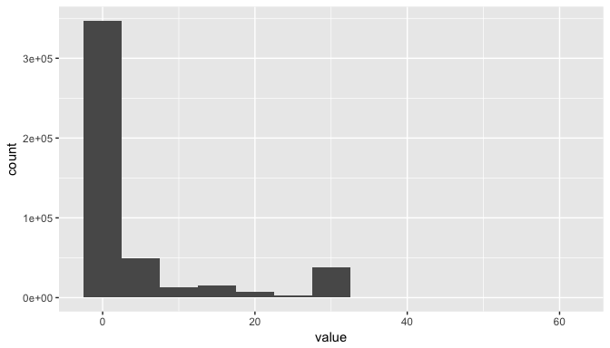<!-- -->

Physhlth seems very similar to previous observations of it. However, the observation which yielded 450 hours of sleep time also yielded 60 days of physical illness, which further affirms the belief that this entry is an error.

###Post data deletion


```r
new.data.rq3 <- data.rq3[-212356,]
new.data.long.rq3 <- melt(new.data.rq3)
```

```
## No id variables; using all as measure variables
```

```r
new.data.long.rq3.phy <- melt(new.data.rq3$physhlth)
new.data.long.rq3.sle <- melt(new.data.rq3$sleptim1)

#new summary of sleptim1
new.data.rq3 %>%
  summarise(mean_sle = mean(sleptim1), med_sle = median(sleptim1), iqr_sle = IQR(sleptim1), sd_sle = sd(sleptim1), max_sle = max(sleptim1), min_sle = min(sleptim1), n = n())
```

```
##   mean_sle med_sle iqr_sle   sd_sle max_sle min_sle      n
## 1 7.049701       7       2 1.457661      24       0 474461
```

```r
#new histogram of sleptim1
ggplot(data = new.data.long.rq3.sle, aes(x = value)) + geom_histogram(binwidth = 1)
```

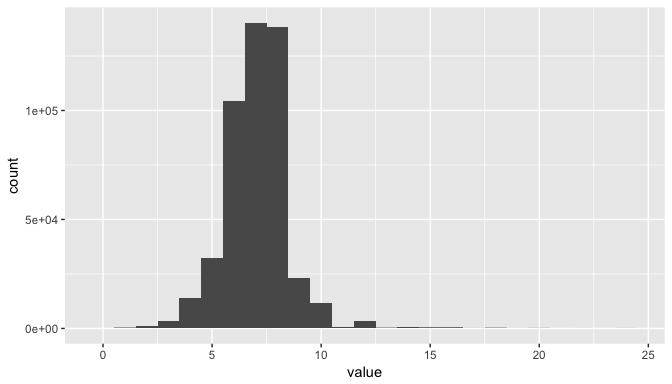<!-- -->

```r
#new summary of physhlth
new.data.rq3 %>%
  summarise(mean_phy = mean(physhlth), med_phy = median(physhlth), iqr_phy = IQR(physhlth), sd_phy = sd(physhlth),  max_phy = max(physhlth), min_phy = min(physhlth),  n = n())
```

```
##   mean_phy med_phy iqr_phy   sd_phy max_phy min_phy      n
## 1  4.29493       0       3 8.783616      30       0 474461
```

```r
#new histogram of physhlth
ggplot(data = new.data.long.rq3.phy, aes(x = value)) + geom_histogram(binwidth = 5)
```

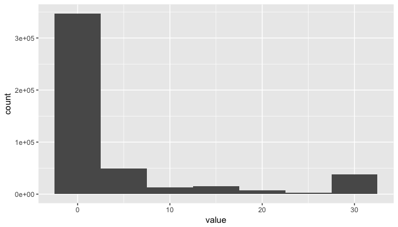<!-- -->

After cleaning the error from the data, it yielded tidier results. In fact, the histogram of sleptim1 looks almost like a normal curve. The physhlth histogram still appears to be unimodal and right skewed, with abnormally large observations of 30 days. 


```r
#boxplot of sleptim1 and physhlth
ggplot(data = new.data.long.rq3, aes(x = variable, y = value)) + geom_boxplot()
```

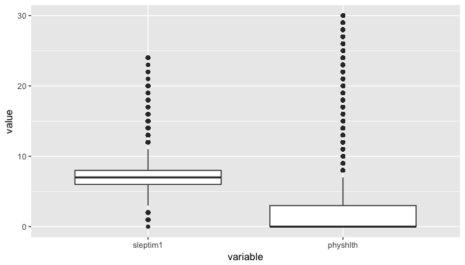<!-- -->

The boxplots confirm the observation from the histograms and summaries that sleptim1 is more centrally distributed with lower spread than physhlth. Nonetheless, sleptim1 does have a list of outlier observations with very high values such as those above 20.


```r
#scatterplot of physhlth and avedrnk2
ggplot(data = new.data.rq3, aes(sleptim1, physhlth)) + 
  geom_point(alpha = 1/5) + geom_smooth()
```

```
## `geom_smooth()` using method = 'gam'
```

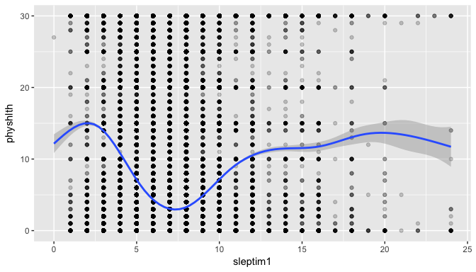<!-- -->

##Conclusion

Based on a crude observation, no clear relationship between the two variables is apparent. However, a model fitted accross the scatterplot appears to show a varying relationship between sleptim1 and physhlth. Between sleeping time of 2.5 hours and 7 hours, there is a negative relationship with poor physical health. However, between 7 and 12.5 hours, there is a positive relationship between poor physical health and sleeping time. Therefore, analysis confirms the notion that optimal sleeping hours are around 7 hours per day.
